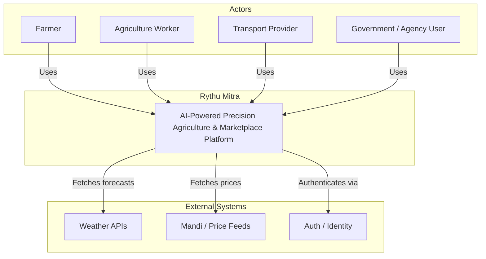
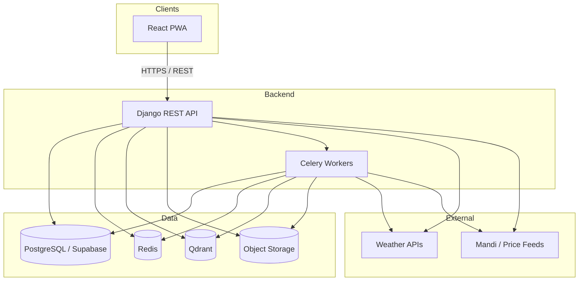
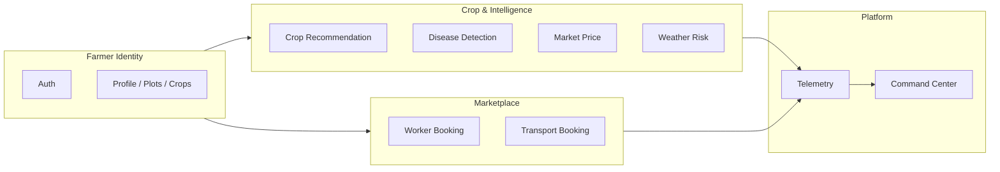
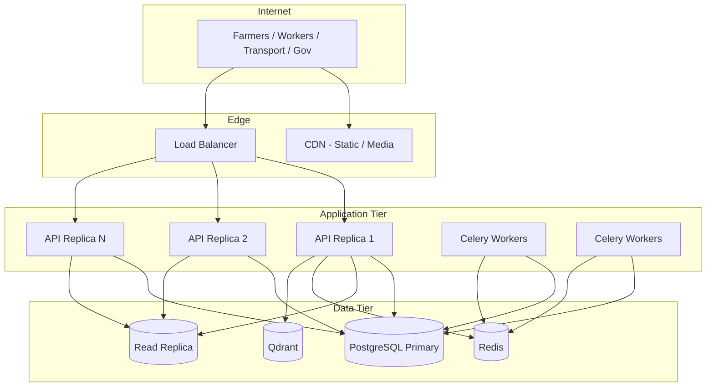
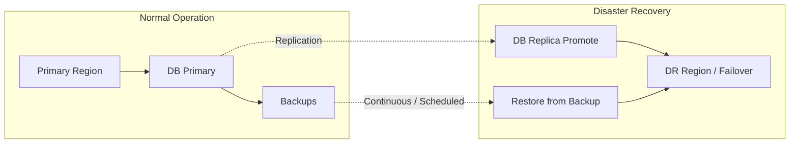
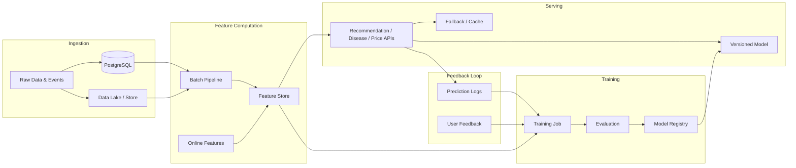
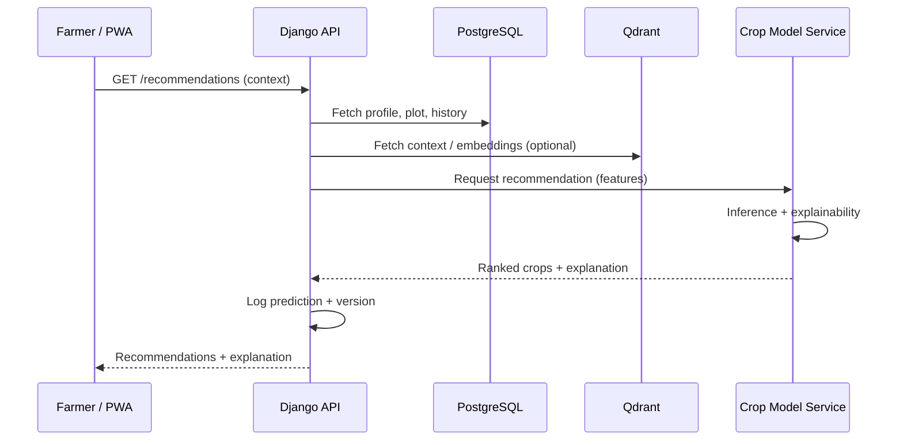
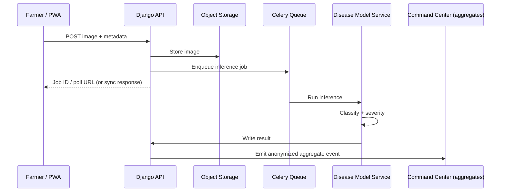
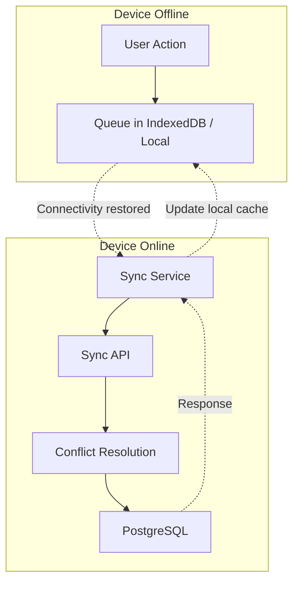
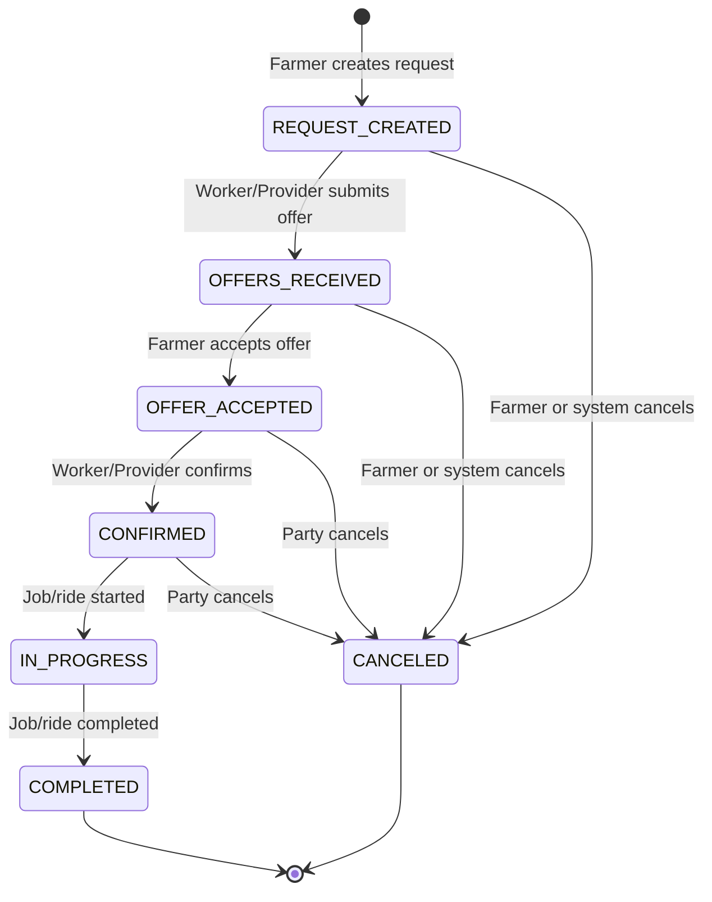

# Rythu Mitra — Enterprise Product Requirements Document

**Document Version:** 1.1  
**Classification:** Internal — Engineering, AI, DevOps, Product  
**Last Updated:** 2026-02-26  
**Changelog (v1.1):** Added §5a Architecture Diagrams (System Context, HLD, Domain Boundaries, Deployment, DR, AI Pipeline, Data Flows for Crop/Disease/Offline Sync, Booking Lifecycle); cross-references from sections 7 and 9.

---

## 1. Executive Summary

Rythu Mitra is an AI-powered precision agriculture and services marketplace platform. It combines crop recommendation, disease detection, market and weather intelligence, and logistics (worker and transport booking) into a single scalable system targeting millions of farmers. The platform is built on Django REST + Supabase (PostgreSQL), React frontend, and a planned Qdrant-based AI memory layer, with offline-first PWA and government-grade reliability as design goals.

**Current state:** Early-stage platform with modular backend structure and React frontend; core AI pipelines, marketplace, and production-scale infrastructure are **Planned** or **In Development**.

**Target state:** Production-ready platform with deployed ML models (crop, disease, price, weather), functioning worker and transport booking, marketplace liquidity, real-time telemetry, and horizontal scalability for 10M+ farmers.

**Future vision:** Continuously learning, feedback-driven system with autonomous model retraining, drift detection, and expanded marketplace network effects.

---

## 2. Business Objectives

| Objective | Description | Priority |
|-----------|-------------|----------|
| Farmer adoption at scale | Achieve and sustain adoption by millions of farmers with measurable engagement and retention. | P0 |
| Prediction accuracy | Deliver crop, disease, price, and weather predictions that meet or exceed defined accuracy benchmarks. | P0 |
| Marketplace liquidity | Establish two-sided liquidity in worker and transport booking with clear supply/demand metrics. | P0 |
| Revenue sustainability | Define and implement monetization levers (e.g., transaction fees, premium features, B2B APIs) without blocking farmer access. | P1 |
| Operational reliability | Meet availability and latency targets suitable for government and high-trust use cases. | P0 |
| AI explainability & governance | Ensure model decisions are explainable and governed for audit and trust. | P1 |

---

## 3. Product Vision & Strategy

**Vision:** Rythu Mitra is the national-scale precision agriculture platform that unifies AI-driven advisory, disease intelligence, market and weather risk, and logistics (workers, transport) into a single farmer-centric and institution-ready system.

**Strategic pillars:**

1. **AI excellence:** High-accuracy, versioned, evaluated models with clear metrics, retraining pipelines, and drift detection.
2. **Farmer-centric UX:** Simple flows, multi-language support, offline-first behavior, and low-friction onboarding.
3. **Marketplace network effects:** Worker and transport booking designed to increase liquidity and utility as adoption grows.
4. **Institution readiness:** Telemetry, dashboards, and compliance posture suitable for government and agency use (e.g., National Command Center).
5. **Scalability & reliability:** Architecture and operations capable of 10M+ farmers, 99.5%+ uptime, and horizontal scaling.

**Out of scope for initial releases:** Direct subsidy disbursement, full CRM for all government users, integration with every legacy state MIS, and advanced research/experimentation tooling.

---

## 4. Current State Analysis

| Area | Status | Notes |
|------|--------|------|
| Backend | **In Development** | Django REST, modular apps (farmers, market, transport, workers, auth). Celery, Redis **Planned**. |
| Frontend | **In Development** | React SPA; PWA and offline-first **Planned**. Tailwind / modern UI in use or planned. |
| Database | **Planned** | Migration to Supabase (PostgreSQL) planned; object storage for media planned. |
| Vector store | **Planned** | Qdrant for AI memory and contextual retrieval not yet integrated. |
| Crop recommendation | **Planned** | No production model or API in place. |
| Disease detection | **Planned** | CV/ML pipeline and APIs not yet implemented. |
| Market price forecasting | **Planned** | Time-series and price APIs not yet implemented. |
| Weather intelligence | **Planned** | Integration and risk APIs not yet implemented. |
| Worker booking | **Planned** | End-to-end flow not yet implemented. |
| Transport booking | **Planned** | End-to-end flow not yet implemented. |
| Marketplace layer | **Planned** | Unified discovery, matching, and settlement not defined. |
| MLOps / model registry | **Planned** | Versioning, evaluation, and deployment pipeline not in place. |S
| Observability | **Planned** | Logging, metrics, tracing stack to be standardized. |
| National Command Center | **Planned** | Dashboard and telemetry aggregation not implemented. |

**Gaps to address:** Production ML pipelines, feature stores, model registry, offline sync, Supabase migration, Qdrant integration, booking and marketplace flows, and full observability.

---

## 5. Target State Architecture

**High-level target:**

- **Frontend:** React SPA with PWA, offline-first with sync, Tailwind-based UI, multi-language, responsive.
- **Backend:** Django REST APIs; Celery + Redis for async and caching; modular services per domain (farmers, market, transport, workers, auth, intelligence).
- **Data:** PostgreSQL (Supabase) for transactional and reference data; object storage for media; Qdrant for vector index (AI memory, retrieval).
- **AI/ML:** Dedicated services or modules for crop, disease, price, weather; feature pipelines; model registry; batch and on-demand inference; feedback ingestion.
- **Infrastructure:** Containerized (Docker), horizontally scalable, cloud-native; centralized logging, metrics, tracing; alerting and runbooks.
- **Security & compliance:** AuthN/AuthZ, encryption in transit and at rest, audit logging, data residency and retention per policy.

**State labels in design docs:** All new components must be marked **Implemented** | **In Development** | **Planned** and tracked in ADRs and backlog.

### 5a. Architecture Diagrams

The following diagrams define system context, high-level architecture, domain boundaries, deployment, and key data flows. Diagrams are in Mermaid format; render in GitHub, GitLab, or any Mermaid-compatible viewer.

| Diagram | Section | Purpose |
|---------|---------|---------|
| System Context | 5a.1 | Actors and external systems |
| High-Level Architecture | 5a.2 | Containers and communication |
| Domain Boundaries | 5a.3 | Bounded contexts |
| Deployment Topology | 5a.4 | Infrastructure layout |
| Disaster Recovery Flow | 5a.5 | Failover and restore |
| AI/ML Pipeline Flow | 5a.6 | Ingestion → training → serving → feedback |
| Data Flow – Crop Recommendation | 5a.7 | Sequence for recommendation API |
| Data Flow – Disease Detection | 5a.8 | Sequence for disease image pipeline |
| Data Flow – Offline Sync | 5a.9 | Offline queue and sync |
| Booking Lifecycle | 5a.10 | Worker/transport booking states |

#### 5a.1 System Context (C4 L1)

Shows actors and external systems interacting with Rythu Mitra.

#### 5a.2 High-Level Architecture (C4 L2)

Main containers and communication.

#### 5a.3 Domain Boundaries (Bounded Contexts)

#### 5a.4 Deployment Topology

#### 5a.5 Disaster Recovery Flow

#### 5a.6 AI/ML Pipeline Flow

#### 5a.7 Data Flow – Crop Recommendation

#### 5a.8 Data Flow – Disease Detection

#### 5a.9 Data Flow – Offline Sync

#### 5a.10 Booking Lifecycle (Worker & Transport)

---

## 6. Problem Statement

1. **Fragmented advisory:** Farmers lack a single, trustworthy source for crop, input, disease, and market decisions, leading to suboptimal yields and income.
2. **Reactive disease management:** Late or manual disease detection increases crop loss and input cost; no scalable, ML-based early warning at plot/region level.
3. **Information asymmetry:** Market prices and weather risk are scattered; farmers cannot easily optimize timing and location for selling or risk mitigation.
4. **Inefficient logistics:** Worker and transport discovery and booking are informal and opaque; no digital marketplace with clear pricing and reliability.
5. **Scale and reliability:** Existing digital agriculture tools do not meet 10M+ farmer scale, offline usage, and government-grade reliability requirements.
6. **AI trust and governance:** Lack of explainability, versioning, and evaluation makes it hard to audit and improve AI-driven recommendations.

---

## 7. Core Product Modules

### 7.1 Farmer Dashboard

| Requirement | Description | Status |
|-------------|-------------|--------|
| Unified entry point | Single dashboard for recommendations, disease, market, weather, and bookings. | Planned |
| Profile & context | Farmer profile, plots, crops, locale, language; used for personalization. | In Development / Planned |
| Notifications & alerts | Weather, price, and disease alerts; booking updates; configurable channels. | Planned |
| Offline access | Critical screens and last-known data available offline with sync when online. | Planned |

**Acceptance (high-level):** Farmer can access a single dashboard, see personalized summary of recommendations and alerts, and navigate to each module; behavior degrades gracefully offline with clear sync status.

**Diagram:** See **§5a.9 Data Flow – Offline Sync** for offline queue and sync flow.

---

### 7.2 Crop Recommendation Engine

| Requirement | Description | Status |
|-------------|-------------|--------|
| Inputs | Soil (where available), location, season, historical cropping, market signals, farmer preferences. | Planned |
| Outputs | Ranked crop options with expected range of outcomes, input needs, and risk indicators. | Planned |
| Explainability | Per-recommendation explanation (key factors, confidence, caveats) in farmer-facing language. | Planned |
| API contract | Stable REST (or internal) API: inputs (farmer/plot context), outputs (crops, scores, explanation). | Planned |
| Versioning | Model version tracked and exposed for audit and rollback. | Planned |

**Acceptance (high-level):** System returns crop recommendations with explanations; recommendations are logged with model version and key inputs for evaluation and drift analysis.

**Diagram:** See **§5a.7 Data Flow – Crop Recommendation** for sequence (PWA → API → DB/Qdrant → Crop Model → response).

---

### 7.3 Disease Detection Engine

| Requirement | Description | Status |
|-------------|-------------|--------|
| Image ingestion | Upload/capture of plant/leaf images; metadata (crop, stage, location, date). | Planned |
| Model inference | CV model(s) for disease/pest classification and severity; batch and real-time paths. | Planned |
| Outputs | Label(s), confidence, severity, suggested actions (e.g., treatment, escalation). | Planned |
| Offline queue | Images and metadata stored locally when offline; synced and processed when online. | Planned |
| Aggregation | Anonymized/aggregated counts for Command Center and early warning. | Planned |

**Acceptance (high-level):** Farmer can submit an image and receive a disease/pest result with actionable guidance; results are versioned and aggregate counts feed dashboards.

**Diagram:** See **§5a.8 Data Flow – Disease Detection** for sequence (upload → store → queue → inference → result → aggregate to Command Center).

---

### 7.4 Market Intelligence Engine

| Requirement | Description | Status |
|-------------|-------------|--------|
| Price data | Ingestion of mandi/official and other authorized price feeds; storage and versioning. | Planned |
| Forecasting | Time-series models for short-term price forecasts by crop and market. | Planned |
| Farmer-facing API | Current and forecast prices, trends, and simple comparison (e.g., nearby markets). | Planned |
| Evaluation | Backtesting and ongoing accuracy metrics (e.g., MAPE, directional accuracy) per model version. | Planned |

**Acceptance (high-level):** Farmers and internal services can query current and forecast prices by crop/market; forecasts have defined accuracy targets and are monitored.

---

### 7.5 Weather Intelligence

| Requirement | Description | Status |
|-------------|-------------|--------|
| Data ingestion | Integration with official meteorological and authorized third-party weather sources. | Planned |
| Forecasts & alerts | Location-based forecasts and configurable alerts (e.g., heavy rain, heat, frost). | Planned |
| Crop-stage relevance | Alerts and risk indicators consider crop stage where data is available. | Planned |
| Offline caching | Recent forecasts and active alerts cached for offline access. | Planned |

**Acceptance (high-level):** Farmer receives relevant weather and risk alerts; Command Center can view weather-related risk at region level.

---

### 7.6 Worker Booking System

| Requirement | Description | Status |
|-------------|-------------|--------|
| Worker profiles | Skills, availability, location, rates (where applicable). | Planned |
| Farmer requests | Creation of job requests (task type, date, location, duration). | Planned |
| Matching & discovery | Search/filter and matching of workers to requests; ranking and relevance. | Planned |
| Booking lifecycle | Request → offer → accept → confirm → complete; status updates and notifications. | Planned |
| Offline support | Request creation offline; sync and conflict handling when online. | Planned |

**Acceptance (high-level):** Farmer can create a worker request and complete a booking; worker can manage availability and accept jobs; lifecycle is auditable and visible in Command Center aggregates.

**Diagram:** See **§5a.10 Booking Lifecycle** for state machine (REQUEST_CREATED → OFFERS_RECEIVED → OFFER_ACCEPTED → CONFIRMED → IN_PROGRESS → COMPLETED; CANCELED from applicable states).

---

### 7.7 Transport Booking System

| Requirement | Description | Status |
|-------------|-------------|--------|
| Transport provider profiles | Vehicle type, capacity, availability, pricing. | Planned |
| Booking requests | Origin, destination, date, load type/weight, preferred vehicle type. | Planned |
| Matching & discovery | Matching of requests to available transport; pricing and ETA. | Planned |
| Booking lifecycle | Request → quote → accept → dispatch → complete; tracking and notifications. | Planned |
| Offline support | Request creation offline; sync when online. | Planned |

**Acceptance (high-level):** Farmer can request transport and complete a booking; provider can manage capacity and fulfill requests; lifecycle is auditable and visible in Command Center.

**Diagram:** Same state machine as worker booking—see **§5a.10 Booking Lifecycle**.

---

### 7.8 Marketplace Layer

| Requirement | Description | Status |
|-------------|-------------|--------|
| Unified discovery | Single entry for workers and transport; filters by location, date, type, price. | Planned |
| Trust & identity | Verification and identity signals for workers and transport providers; no full reputation system in v1. | Planned |
| Settlement | Definition of payment flows (e.g., in-app, external); transaction recording for analytics and fees. | Planned |
| Liquidity metrics | Dashboards and metrics for supply/demand, match rate, fill rate, repeat usage. | Planned |

**Acceptance (high-level):** Worker and transport booking are discoverable through a consistent marketplace experience; key liquidity and transaction metrics are measurable.

---

## 8. AI & Data Strategy

### 8.1 Model Taxonomy

| Model domain | Purpose | Type | Inputs | Outputs | Status |
|--------------|---------|------|--------|--------|--------|
| Crop recommendation | Crop choice and planning | Ranking/classification | Soil, location, season, history, market | Ranked crops, scores, explanation | Planned |
| Disease detection | Disease/pest identification | CV classification (multiclass/multi-label) | Image + metadata | Labels, confidence, severity, actions | Planned |
| Market price | Short-term price forecast | Time-series | Historical prices, calendar, external signals | Point and interval forecasts | Planned |
| Weather risk | Risk scoring and alerts | Classification/regression | Forecasts, crop stage, thresholds | Risk level, alerts | Planned |
| Matching (workers/transport) | Relevance and ranking | Retrieval + ranking | Query, profile, availability | Ranked list, scores | Planned |

### 8.2 Data Sources

| Source type | Examples | Usage | Governance |
|-------------|----------|--------|------------|
| Farmer-provided | Profile, plot, crop, images, bookings | Training (anonymized/aggregated), inference, product | Consent and retention policy |
| Official | Mandi prices, weather, soil, schemes | Features and evaluation | License and attribution |
| Third-party | Weather, satellite (if adopted) | Features | Contracts and data use limits |
| Platform | Logs, feedback, outcomes | Training, evaluation, drift | Internal access control and retention |

### 8.3 Feature Engineering

- **Centralized feature definitions:** Feature names, types, and lineage documented; shared where possible across crop, price, and weather models.
- **Temporal and spatial:** Location (lat/long, district, block), date, season, crop stage; lagged and rolling aggregates for time-series.
- **Quality and freshness:** Validation rules, missing-value handling, and max staleness for production features.
- **Feature store (planned):** Offline and online feature serving for training and inference; versioning and backfill capability.

### 8.4 Evaluation Metrics

| Domain | Primary metrics | Secondary |
|--------|-----------------|-----------|
| Crop recommendation | Top-k accuracy, alignment with expert/outcome where available | Diversity, calibration |
| Disease detection | Per-class precision/recall/F1, confusion matrix | Severity alignment, latency |
| Market price | MAPE, RMSE, directional accuracy over 1–2 week horizon | Coverage by crop/market |
| Weather risk | Alert precision/recall, lead time | Coverage |
| Matching | Match rate, acceptance rate, time-to-match | NDCG, diversity |

Targets to be set per phase and reviewed quarterly.

### 8.5 Continuous Learning & Feedback

- **Explicit feedback:** Thumbs up/down, “was this helpful,” correction of labels (e.g., disease).
- **Implicit signals:** Recommendation acceptance, repeated use, booking completion.
- **Outcome data:** Where available (e.g., yield, realized price), used for evaluation and retraining.
- **Pipeline (planned):** Feedback ingestion → validation → training pipeline → evaluation → promotion to staging/production with rollback.

### 8.6 Drift Detection

- **Data drift:** Feature distributions (e.g., weekly) vs. training/reference window; alerts on threshold breach.
- **Model performance drift:** Ongoing evaluation on recent data; alerts on metric degradation.
- **Action:** Drift triggers review and optional retraining or rollback; documented in model registry.

### 8.7 Model Lifecycle Management

- **Registry (planned):** Model artifact, version, code/config, training data reference, metrics, approval state.
- **Promotion:** Dev → Staging → Production with gates (e.g., accuracy, latency, fairness checks).
- **Rollback:** One-step rollback to previous production model; A/B or shadow mode where appropriate.
- **Deprecation:** Retire old models on a schedule; archive artifacts and metadata.

---

## 9. System Architecture

### 9.1 Frontend Architecture

| Element | Choice | Status |
|---------|--------|--------|
| Framework | React (SPA) | In Development |
| Styling | Tailwind / design system | In Development / Planned |
| State | Client state (e.g., React state, context, or chosen state library) | In Development |
| API layer | REST client with auth, retries, error handling | In Development |
| PWA | Service worker, caching, installability | Planned |
| Offline | Local storage/IndexedDB, sync queue, conflict handling | Planned |
| i18n | Multi-language and locale | Planned |

**Principles:** Component-based, lazy loading for routes, accessibility (WCAG 2.x), responsive layout, and clear separation between UI and API contracts.

### 9.2 Backend Architecture

| Element | Choice | Status |
|---------|--------|--------|
| API framework | Django REST Framework | In Development |
| App structure | Modular apps: farmers, market, transport, workers, auth, intelligence (or equivalent) | In Development |
| Async tasks | Celery | Planned |
| Cache | Redis | Planned |
| Auth | JWT or session-based; role-based access; integration with Supabase Auth if adopted | In Development / Planned |
| API versioning | URL or header versioning; backward compatibility policy | Planned |

**Principles:** Stateless services, idempotency where applicable, structured errors, rate limiting, and request correlation IDs for tracing.

### 9.3 Database Architecture

| Store | Role | Status |
|-------|------|--------|
| PostgreSQL (Supabase) | Transactional and reference data: users, plots, crops, bookings, telemetry, config | Planned |
| Object storage | Images, documents, model artifacts | Planned |
| Qdrant | Vector index for AI memory, semantic search, contextual retrieval | Planned |
| Redis | Cache, Celery broker, session store | Planned |

**Principles:** Schema migrations via versioned scripts; connection pooling; read replicas for scaling reads (planned); backup and point-in-time recovery; no PII in vectors without policy approval.

### 9.4 AI Pipeline Architecture

| Stage | Responsibility | Status |
|-------|----------------|--------|
| Ingestion | Raw data and events into data lake or DB | Planned |
| Feature computation | Batch and online feature pipelines; feature store | Planned |
| Training | Reproducible training jobs; model registry; evaluation | Planned |
| Serving | REST or internal APIs; versioned model endpoints; fallback and timeout | Planned |
| Feedback loop | Logging predictions and feedback; pipeline to retraining | Planned |

**Inference modes:** Synchronous for low-latency paths (e.g., crop recommendation, disease); async/batch for heavy or non-real-time (e.g., bulk price forecasts). Queue (Celery) for async inference jobs.

**Diagram:** See **§5a.6 AI/ML Pipeline Flow** for end-to-end pipeline (ingestion → features → training → registry → serving → feedback).

### 9.5 Real-Time vs Batch Processing

| Use case | Mode | Rationale |
|----------|------|-----------|
| Crop recommendation | Real-time (sync API) | Sub-second response for UX |
| Disease detection | Sync or short async (e.g., queue, poll) | Balance latency vs. compute |
| Price forecast | Batch + cache | Forecasts updated periodically (e.g., daily) |
| Weather alerts | Near-real-time (scheduled jobs + push) | Fresh alerts within agreed SLA |
| Telemetry aggregation | Stream or batch | Near-real-time for dashboards; batch for analytics |
| Model training | Batch | Scheduled or trigger-based |
| Offline sync | Async queue | Process when device is online |

---

## 10. Scalability & Performance Strategy

- **Horizontal scaling:** Stateless API and worker nodes; scale out behind load balancer; DB connection pool limits and read replicas.
- **Caching:** Redis for sessions, hot API responses, and computed features; cache invalidation rules documented.
- **CDN & static assets:** Frontend and media served via CDN; cache headers and versioning.
- **Database:** Indexing per query patterns; partitioning for large tables (e.g., telemetry, logs); connection pooling; avoid N+1.
- **Async:** Heavy or non-critical work offloaded to Celery; queue monitoring and backpressure handling.
- **Rate limiting:** Per user/API key and per endpoint to protect backend and ensure fair use.
- **Targets (to be finalized):** P95 API latency (e.g., &lt; 500 ms for critical paths), throughput (e.g., X req/s per core), and DB query latency under load.

---

## 11. Reliability & High Availability

- **Availability target:** 99.5% monthly uptime for core APIs and PWA availability; path to 99.9% with redundancy and failover.
- **Deployment:** Zero-downtime deployments (rolling or blue/green); health checks and readiness/liveness probes.
- **Failure handling:** Graceful degradation (e.g., fallback model or cached response); circuit breakers for external dependencies; retries with backoff.
- **Data durability:** Regular backups; tested restore; point-in-time recovery for PostgreSQL.
- **Disaster recovery:** Documented RTO/RPO; runbooks for major failures; periodic DR drills.
- **Incident management:** Alerting, on-call, post-incident reviews, and tracking of follow-up actions.

---

## 12. Security & Data Privacy

- **Authentication:** Secure, standard-based auth (e.g., OAuth2, JWT); MFA option for sensitive roles.
- **Authorization:** RBAC; resource-level checks for farmer data and admin actions; principle of least privilege.
- **Data in transit:** TLS for all client and service-to-service communication.
- **Data at rest:** Encryption for DB and object storage; key management per cloud/provider policy.
- **PII and sensitive data:** Minimization; retention and deletion per policy; no unnecessary logging of PII.
- **Audit:** Logging of access and mutations for sensitive data and admin actions; tamper-resistant or append-only where required.
- **Vulnerability management:** Regular dependency and container scanning; penetration testing for major releases.
- **Vector store:** No raw PII in Qdrant unless explicitly approved; access control and retention aligned with policy.

---

## 13. Compliance & Governance Considerations

- **Data residency:** Deployment and storage in regions required by law or contract.
- **Retention:** Defined retention for logs, telemetry, and user data; automated or documented deletion.
- **Consent:** Where required, consent for data use and marketing; audit trail of consent.
- **Agriculture and government:** Alignment with applicable agriculture, digital governance, and data protection regulations; documentation for audits.
- **AI governance:** Model registry, versioning, and change control; explainability and fairness review for high-impact models; human oversight where appropriate.
- **Vendor and subprocessors:** Supabase, cloud provider, and other processors covered by DPA and risk assessment where applicable.

---

## 14. Monetization Strategy

- **Transaction-based:** Fee on completed worker or transport bookings (e.g., % or fixed); clear disclosure to farmers and providers.
- **Premium features (planned):** Advanced insights, longer price history, or priority support as paid tiers.
- **B2B / API (planned):** Licensed API or data products for agribusiness, insurers, or government; rate limits and SLAs.
- **Advertising (optional):** Non-intrusive, policy-compliant placements; no conflict with core farmer trust.
- **Constraints:** Free tier or subsidized access for core advisory and safety (e.g., disease, weather); monetization must not block essential use cases for smallholders.

---

## 15. Marketplace Economics & Network Effects

- **Supply:** Workers and transport providers onboarded and verified; capacity and availability kept updated to improve match rate.
- **Demand:** Farmer requests with clear specs (date, location, task/load); repeat usage and retention as key metrics.
- **Liquidity metrics:** Match rate, time-to-match, fill rate, repeat bookings; tracked by region and segment.
- **Network effects:** More farmers → more attractive for providers; more providers → better experience for farmers; feedback loops to be measured and optimized.
- **Trust:** Identity and verification; clear terms; dispute handling (basic in v1); no full reputation system required for launch.

---

## 16. KPIs & Success Metrics

### 16.1 Farmer Adoption

| Metric | Definition | Target (example) | Status |
|--------|------------|------------------|--------|
| Registered farmers | Count of registered farmer accounts | Growth to 10M+ over roadmap | Planned |
| MAU | Unique farmers active in last 30 days | % of registered; growth Q over Q | Planned |
| DAU/MAU ratio | Stickiness | &gt; 0.2 | Planned |
| Retention (D30, D90) | % returning after first month/quarter | Defined per cohort | Planned |
| Onboarding completion | % completing profile/onboarding flow | &gt; 70% | Planned |

### 16.2 Prediction Accuracy Benchmarks

| Model | Metric | Target (example) | Review cadence |
|-------|--------|------------------|----------------|
| Crop recommendation | Top-3 accuracy or expert alignment | TBD | Quarterly |
| Disease detection | Per-class F1 / macro F1 | TBD | Quarterly |
| Market price | MAPE 7-day horizon | &lt; 15% (example) | Monthly |
| Weather risk | Alert precision/recall | TBD | Quarterly |

### 16.3 Marketplace Liquidity Metrics

| Metric | Definition | Target (example) |
|--------|------------|------------------|
| Match rate | % of requests matched to at least one offer | &gt; 80% |
| Fill rate | % of matches resulting in completed booking | TBD |
| Time-to-match | Median time from request to first match | &lt; 24 h (example) |
| Repeat rate | % of farmers/providers with 2+ bookings | TBD |

### 16.4 Revenue Metrics

| Metric | Definition | Target (example) |
|--------|------------|------------------|
| GMV (bookings) | Sum of booking value (worker + transport) | Growth target TBD |
| Take rate | Revenue / GMV | TBD |
| ARPU | Revenue / MAU (or per paying user) | TBD |

---

## 17. Risk Assessment

### 17.1 Technical Risks

| Risk | Impact | Mitigation |
|------|--------|------------|
| Scale limits (DB, API) | Degraded UX, outages | Load testing, scaling design, indexing, caching |
| Single points of failure | Downtime | Redundancy, health checks, failover, DR |
| Tech debt | Slower delivery, bugs | Allocated refactor time, ADRs, code review |
| Integration failures (weather, prices) | Stale or missing data | Fallbacks, SLAs with providers, monitoring |

### 17.2 AI Risks

| Risk | Impact | Mitigation |
|------|--------|------------|
| Low accuracy | Loss of trust, poor decisions | Benchmarks, evaluation pipeline, human review for high-stakes |
| Bias (e.g., region, crop) | Unfair outcomes | Fairness metrics, diverse data, regular audit |
| Drift | Silent degradation | Drift detection, retraining triggers, alerts |
| Explainability gaps | Audit and trust issues | Explainability requirements per model, documentation |

### 17.3 Data Risks

| Risk | Impact | Mitigation |
|------|--------|------------|
| PII breach | Legal, reputational | Minimization, encryption, access control, audit |
| Data quality | Bad model and product outcomes | Validation, lineage, monitoring |
| Consent and retention | Compliance violations | Clear policies, consent flow, automated retention |

### 17.4 Adoption Risks

| Risk | Impact | Mitigation |
|------|--------|------------|
| Low adoption | No network effects, no revenue | UX research, onboarding optimization, partnerships |
| Offline not used | Poor experience in low connectivity | PWA and sync prioritized, user education |
| Provider shortage | Low match rate | Supply-side incentives, onboarding, liquidity metrics |

---

## 18. Roadmap

### Phase 1: Foundational Platform

**Goal:** Stable core platform, identity, and data foundation.

- Supabase (PostgreSQL) migration; object storage for media.
- Auth and farmer profile (plots, crops, locale); multi-language baseline.
- React dashboard shell and navigation; API contracts for all modules.
- Worker and transport data models and basic CRUD APIs.
- Observability: logging, metrics, tracing; alerting and runbooks.
- **Deliverables:** Deployable app with profile, core APIs, and observability. **Status:** In Development / Planned.

### Phase 2: ML Integration

**Goal:** First production ML models and feature pipelines.

- Qdrant integration; AI memory and retrieval for crop and context.
- Crop recommendation: feature pipeline, model, API, explainability.
- Disease detection: image ingestion, CV model, API, offline queue.
- Market price: data ingestion, time-series model, forecast API.
- Weather: ingestion, risk logic, alerts and caching.
- Model registry and basic versioning; evaluation scripts.
- **Deliverables:** Live crop, disease, price, and weather capabilities with versioned models. **Status:** Planned.

### Phase 3: Predictive Intelligence & Marketplace

**Goal:** Full farmer flows and marketplace liquidity.

- End-to-end worker booking (request, match, lifecycle, notifications).
- End-to-end transport booking (request, match, lifecycle).
- Marketplace layer: unified discovery, matching, basic settlement.
- Offline-first PWA: sync, conflict handling, cached content.
- National Command Center: telemetry aggregation, dashboards, alerts.
- Continuous learning pipeline: feedback ingestion, retraining, promotion.
- Drift detection and model lifecycle automation.
- **Deliverables:** Complete booking flows, marketplace metrics, offline PWA, Command Center, and learning loop. **Status:** Planned.

### Phase 4: Autonomous Adaptive Agriculture System

**Goal:** Self-improving system and expanded value.

- Automated retraining and promotion based on drift and performance.
- Richer AI memory and personalization (Qdrant, context).
- Advanced marketplace features (e.g., reputation, dispute handling).
- B2B/API and premium tiers if validated.
- IoT/satellite integration if scope approved.
- **Deliverables:** Defined per business priorities; phase is exploratory. **Status:** Future.

---

## 19. Appendices

### A. Assumptions

- Supabase (PostgreSQL) and chosen cloud provider meet latency, scale, and compliance requirements.
- Sufficient and lawful access to mandi/official price data and weather data for target regions.
- Farmer and provider adoption can be achieved through product, partnerships, and incentives.
- Regulatory environment allows collection and use of farmer and booking data for product and ML within defined consent and retention.
- Team capacity and skills (backend, frontend, ML, DevOps) are available to execute Phases 1–3.
- Government or institutional use (e.g., Command Center) does not require customizations that conflict with single codebase and scale goals.

### B. Open Questions

- Exact availability target (99.5 vs 99.9) and RTO/RPO by environment.
- Final data residency and certification requirements (e.g., specific standards).
- Prioritization of languages and regions for first multi-language and geography rollout.
- B2B/API pricing and packaging.
- Whether full reputation/rating system is in scope for marketplace post–Phase 3.
- Satellite or IoT integration scope and timeline.

### C. Technical Debt Considerations

- Document and track any shortcuts taken in Phase 1 (e.g., auth, schema) with remediation in backlog.
- Plan refactoring when consolidating duplicate or prototype ML code into shared pipelines and registry.
- Define API stability and versioning policy before external or B2B consumption.
- Address frontend bundle size and performance as PWA and features grow.
- Regular dependency and security updates; dedicated sprint allocation for maintenance and debt.

---

*End of PRD.*
